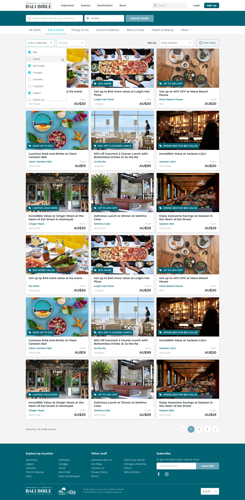

# TRAVLR Front-End Coding Test

Be sure to read **all** of this document carefully, and follow the guidelines within.

## Context

Use HTML, CSS, and JavaScript to implement the following mock-up. You will need to leverage an API service for the data to fill in the details and functionality as described below, you could skip this process by using mockup data in JSON. You are only required to complete the UI views with a proper and nice user experience.

Use this Sketch file to see fonts, colors, size and responsive design in detail.

> [Source Sketch file](travlr-frontend-test.sketch)

## Requirements

### Functionality

- The filter navigation needs to be able to perform real time filtering on both client side data, as well as server side queries.
- `See map` button clicked should show Map view with dropped pin (you could use your own design)
- Responsive (mobile+tablet) version
- Compatibility with all browsers especially *I.E > 8*

### Tech stack

- Use **Vue & Vuex**
- Use _linter_
- Use a preprocessor like SASS/SCSS/Less but _do not_ use any CSS frameworks or libraries.
- Use *BEM* methodology
- _No jQuery_

### Bonus

- Write clear **documentation** on how the app was designed and how to run the code.
- Provide proper unit tests.
- Map view (using own design)
- Use Typescript

## What We Care About

Use any libraries that you would normally use if this were a real production App. Please note: we're interested in your code & the way you solve the problem, not how well you can use a particular library or feature.

_We're interested in your method and how you approach the problem just as much as we're interested in the end result._

Here's what you should strive for:

- Good use of current HTML, CSS, and JavaScript & performance best practices.
- Solid testing approach.
- Extensible code.

## Q&A

> Where should I send back the result when I'm done?

Fork this repo and send us a pull request when you think you are done. The deadline for this task is 3 days after you got this test.

> What if I have a question?

Just create a new issue in this repo and we will respond and get back to you quickly.
